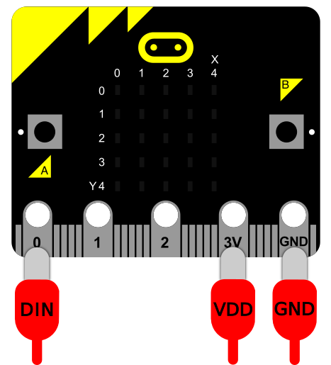

# MakeCode Extension for LED Matrix (WS2812)

[](https://makecode.microbit.org/)
[](https://opensource.org/licenses/MIT)

This extension provides a full-featured driver for controlling WS2812-based (NeoPixel-compatible) LED matrices of any dimension on the BBC micro:bit.

The extension code is based on https://github.com/Microsoft/pxt-neopixel, branched off https://github.com/51bit/colorbit (though eventually completely rewritten, so no reference of Colorbit remains) and developed for generic 8x8 WS2812B boards sold on AliExpress, with the intention of supporting any X*Y LED matrices.

It allows for easy configuration of matrix size and layout, with powerful blocks for setting individual pixels, drawing text, scrolling, and performing transformations like shifting, rotating, and flipping.

## Physical LED Matrix connection
The connection diagram is referenced from [Neopixel documentation page](https://microbit-micropython.readthedocs.io/en/v1.0.1/neopixel.html):



Instead of connecting the LED matrix to VDD and GND from micro:bit, it can be connected to external power supply. In such case need to connect GND from micro:bit to GND from the external power supply:


## How to Use

1.  Open the [MakeCode Editor for micro:bit](https://makecode.microbit.org/).
2.  Click on **Advanced** and then **Extensions**.
3.  Search for `https://github.com/jackr1w/LedMatrixXY` and click to add it to your project.

## Blocks

The extension is organized into three convenient groups:

### Configuration

These blocks are used to set up the matrix and manipulate its contents.

* **LedMatrixXY at pin ...**: The main block to initialize your matrix. Define the data pin, dimensions, and layout type.
    ```blocks
    let ledmatrix = ledmatrixxy.create(DigitalPin.P0, 8, 8, true, true, ledmatrixxy.LEDControlMode.GRB)
    ```
* **set pixel at X Y to color**: Sets a single pixel at a specific coordinate to a given color.
* **fill with color**: Fills the entire matrix with a single color.
* **clear**: Clears the entire matrix (sets all pixels to black).
* **shift X/Y**: Shifts the matrix content horizontally or vertically.
* **rotate**: Rotates the entire matrix by 90°, 180°, or 270°.
* **flip horizontally/vertically**: Mirrors the matrix content.

### Output

These blocks are used to display content on the matrix.

* **show**: **This is the most important block!** Changes made with other blocks are not visible until you call `show`. This block sends the data to the LEDs.
    ```blocks
    ledmatrix.show()
    ```
* **print character**: Displays a single character in the center of the matrix.
* **print line**: Scrolls a line of text across the matrix.

### Variables

These blocks provide easy ways to create and manage colors.

* **color dropdown**: A list of common, predefined colors.
* **RGB value**: Input a custom color using a hex value (e.g., `0xFF7000`).
* **Red Green Blue**: Create a color from its R, G, B components.
* **Red Green Blue White**: Create a color for RGB+W strips.
* **hue saturation luminosity**: Create a color using the HSL color model, great for rainbow effects.

## Example: Rainbow Scroll

This example shows how to create a scrolling rainbow effect across an 8x8 matrix.

```typescript
let ledmatrix = ledmatrixxy.create(
    DigitalPin.P0,
    8,
    8,
    true,
    false,
    ledmatrixxy.LEDControlMode.GRB
)

basic.forever(function () {
    for (let i = 0; i < 360; i++) {
        ledmatrix.shiftX(-1, true)
        for (let y = 0; y < 8; y++) {
            ledmatrix.setPixel(7, y, ledmatrixxy.hsl(i, 99, 50))
        }
        ledmatrix.show()
        basic.pause(20)
    }
})
